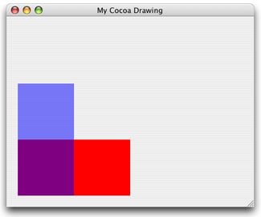

### 创建位图图形上下文

位图图形上下文接受一个内存区域指针。
当绘图到位图图形上下文时，这个内存区域会更新。
释放位图图形上下文后，得到一个完全更新过的你指定像素格式的位图。
__离屏渲染注意：位图图形上下文有时用于离屏绘制。如果需要离屏绘制可以考虑下[Core Graphics Layer Drawing](https://developer.apple.com/library/content/documentation/GraphicsImaging/Conceptual/drawingwithquartz2d/dq_layers/dq_layers.html#//apple_ref/doc/uid/TP30001066-CH219-TPXREF101)。CGLayer 对象（CGLayerRef）针对离屏绘图优化过，Quartz会尽量把它们缓存在显存里边__

__iOS注意：iOS app 需要使用 UIGraphicsBeginImageContextWithOptions 替代提到的 Quartz 低级创建函数。如果 app 使用 Quartz 创建离屏位图上下文，其坐标系是默认 Quartz 坐标系。相对的如果使用 UIGraphicsBeginImageContextWithOptions 创建的话坐标系会修正为 UIkit 坐标系，坐标规范与 UIView 一样。这可以使用同样的绘图代码不用担心坐标系不一样。虽然你也可以自己调整转换矩阵达到正确的结果，但是这样做也不会提升性能。__

你可以使用 CGBitmapContextCreate 创建位图上下文。（iOS 使用 UIGraphicsBeginImageContextWithOptions 创建）（todo)
这个函数需要下边的参数：
* data： 内存指针，内存块大小至少是 bytesPerRow*height bytes
* width： 宽多少个像素
* height： 高多少个像素
* bitsPerComponent：每个像素的颜色分类占多少位内存。如RGB颜色空间32位像素格式 bitsPerComponent 为 8 。参考[ Supported Pixel Formats](https://developer.apple.com/library/content/documentation/GraphicsImaging/Conceptual/drawingwithquartz2d/dq_context/dq_context.html#//apple_ref/doc/uid/TP30001066-CH203-BCIBHHBB)
* bytesPerRow：每行指定多少字节
* colorspace： 参考：[Color and Color Spaces](https://developer.apple.com/library/content/documentation/GraphicsImaging/Conceptual/drawingwithquartz2d/dq_color/dq_color.html#//apple_ref/doc/uid/TP30001066-CH205-TPXREF101)
* bitmapInfo：位图布局信息


列表2-5 创建位图图形上下文（iOS不是这样）
```
CGContextRef MyCreateBitmapContext (int pixelsWide,
                            int pixelsHigh)
{
    CGContextRef    context = NULL;
    CGColorSpaceRef colorSpace;
    void *          bitmapData;
    int             bitmapByteCount;
    int             bitmapBytesPerRow;

    bitmapBytesPerRow   = (pixelsWide * 4);// 1
    bitmapByteCount     = (bitmapBytesPerRow * pixelsHigh);

    colorSpace = CGColorSpaceCreateWithName(kCGColorSpaceGenericRGB);// 2
    bitmapData = calloc( bitmapByteCount, sizeof(uint8_t) );// 3
    if (bitmapData == NULL)
    {
        fprintf (stderr, "Memory not allocated!");
        return NULL;
    }
    context = CGBitmapContextCreate (bitmapData,// 4
                                    pixelsWide,
                                    pixelsHigh,
                                    8,      // bits per component
                                    bitmapBytesPerRow,
                                    colorSpace,
                                    kCGImageAlphaPremultipliedLast);
    if (context== NULL)
    {
        free (bitmapData);// 5
        fprintf (stderr, "Context not created!");
        return NULL;
    }
    CGColorSpaceRelease( colorSpace );// 6

    return context;// 7
}
```
（todo)


列表2-6展示了调用 MyCreateBitmapContext (列表2-5) 创建位图上下文,
并用它创建了 CGImage 对象并绘制在窗口。绘图结果如图2-3。

列表2-6
```
CGRect myBoundingBox;// 1

  myBoundingBox = CGRectMake (0, 0, myWidth, myHeight);// 2
  myBitmapContext = MyCreateBitmapContext (400, 300);// 3
  // ********** Your drawing code here ********** // 4
  CGContextSetRGBFillColor (myBitmapContext, 1, 0, 0, 1);
  CGContextFillRect (myBitmapContext, CGRectMake (0, 0, 200, 100 ));
  CGContextSetRGBFillColor (myBitmapContext, 0, 0, 1, .5);
  CGContextFillRect (myBitmapContext, CGRectMake (0, 0, 100, 200 ));
  myImage = CGBitmapContextCreateImage (myBitmapContext);// 5
  CGContextDrawImage(myContext, myBoundingBox, myImage);// 6
  char *bitmapData = CGBitmapContextGetData(myBitmapContext); // 7
  CGContextRelease (myBitmapContext);// 8
  if (bitmapData) free(bitmapData); // 9
  CGImageRelease(myImage);

```
代码解释（todo)


图2-3 从位图图形上下文创建图片然后显示在窗口


