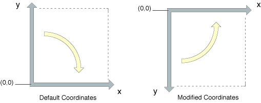

### 坐标系 （todo)

Quartz 使用CTM（current transformation matrix）将用户空间坐标系映射到输出设备空间坐标系达到坐标系设备无关。
矩阵是一种描述一系列方程的数学工具。
CTM 是一种特别仿射变换矩阵，通过移动、旋转及缩放把一个坐标系的点变换到另外一个坐标系。

CTM 的第二个目的是变换对象绘制。
如：画一个旋转45度的盒子，在绘制盒子前旋转页面的坐标系(CTM)。
Quartz 用旋转后的坐标系绘制到输出设备。

在用户空间中的点表示为坐标对(x,y), x 表示在横坐标上（左右）的位置, y坐标表示在纵坐标（上下)的位置。
用户空间的原点是(0,0)，在页面的左下角，如图1-4。
Quartz 默认坐标系 x轴 从左往右增长，y轴从下往上增长。

别的技术会使用与 Quartz 不同的默认坐标系。
相对 Quartz ,有的坐标系 需要修正坐标系及一些操作后补偿坐标系。（译者：不懂 Relative to Quartz, such a coordinate system is a modified coordinate system and must be compensated for when performing some Quartz drawing operations. ）
最常见的修正坐标系是把原点调整到左上角，把y轴改为从上往下增长。
一些特别的坐标系如下：
* macOS :  
* iOS UIView中的图形上下文
* iOS UIGraphicsBeginImageContextWithOptions 创建的图形上下文

UIKit 返回图形上下文是修正坐标系的原因是 UIKit 使用不同的坐标规范需要保持一致。
如果你的应用程序需要输出到 UIView 及 PDF 图形上下文（用Quartz 创建使用默认坐标系），你需要转换下PDF 图形上下文让它有同一的修正坐标系。
要这样做需要移动原点到左上角，然后缩放y轴 -1 。

Quartz 绘制也使用缩放 负y轴 做些其它操作。如：如果使用  CGContextDrawImage 绘制一个图片到图形上下文, 图片绘制时会被变换修正。相似的绘制弧形路径时顺时针方向逆时针方向也是用缩放负坐标实现。
坐标系修改后结果也会变化，就像镜子一样。图1-5 同样的绘制操作不同的坐标系统结果不一样。

图1-5 修改坐标系 创建镜像图片

应用程序调整哪个绘制取决于你是否应用修正变换。
例如：如果你想图片或者PDF 正确绘制到 图形上下文，你的应用程序需要临时调整图形上下文 CTM 。
iOS 中如果你使用 UIImage 封装你创建的 CGImage 对象，你不需要修改CTM。UIImage 会由 UIKit 自动调整坐标系。

__iOS 无需修正坐标。 UIKit 为应用程序创建 图形上下文时 已经做了相应的调整 __
