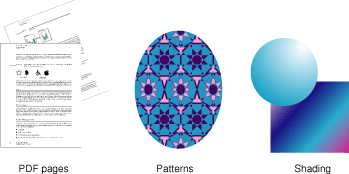

### 不透明数据类型

除图形上下文外 Quartz 2D API 还定义了很多其它不透明数据类型。
由于 API 是 CoreGraphics 框架的一部分，这些数据类型及方法都以 CG 开头。

应用程序 调用 Quartz 2D API 从这些数据类型中创建对象操作达到绘制目的。
图1-3 展示了你应用3种 Quartz 2D 对象绘制达到的一些效果。如：
* 创建PDF page object然后旋转图形上下文 后 旋转显示PDF
* 用pattern object 绘制模版
* 渐变效果

图1-3 Quartz 中不透明数据类型是绘图的基本元素

Quartz 2D 中的不透明数据类型有：(TODO)
* CGPathRef
* CGImageRef
* CGLayerRef
* CGPatternRef
* CGShadingRef & CGGradientRef
* CGFunctionRef
* CGColorRef 与 CGColorSpaceRef
* CGImageSourceRef 与 CGImageDestinationRef
* CGFontRef
* CGPDFDictionaryRef, CGPDFObjectRef, CGPDFPageRef, CGPDFStream, CGPDFStringRef, and CGPDFArrayRef
* CGPDFScannerRef and CGPDFContentStreamRef
* CGPSConverterRef
