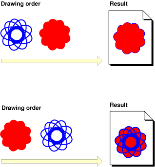

### 画布
Quartz 2D 使用画家模型绘画。每个绘画操作应用到画布上的一个绘画层。
一个东西画上画布后只能被别的东西盖在上边进行调整不能直接修改。画家模型利用较少的元素构造精美的图像。

图1-1 展示了画家模型如何工作。要画出最右边的图像（图1-1上部分），先画出蓝色图形然后画红色图形，红色图形盖住左边图形只留下边缘。
图形绘制的相对顺序反过来先画红色图形再画蓝色图形就会得到蓝色盖在红色图形的结果（如图1-1下部分）。

就像你看到的，画家模型中元素绘制的顺序很重要。

图1-1 画家模型

