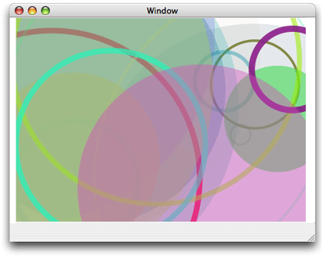

### 弧线

弧线是圆的一段。
Quartz 提供两个创建弧线的函数。
函数 CGContextAddArc 从圆中创建一个弧线。
需要指定圆心、半径及弧度。
弧度为 2pi 时表示创建一个完整的圆。
图3-4 展示多个独立绘制的路径。
每个路径包含一个随机生成的圆；有些是被填充，有些的绘制了轮廓。

图3-4 多个路径；每个路径包含随机生成的圆

函数 CGContextAddArcToPoint 比较适合绘制圆角效果。
Quartz 使用提供的终点创建切线。
也可以提供用于 Quartz 切弧线的圆半径。
弧线的圆心就是两个半径的交集 (译者：不懂 The center point of the arc is the intersection of two radii, each of which is perpendicular to one of the two tangent lines.)
每个终点是切线的切点。
如图3-5 圆上红色部分就是真正绘制的部分。

图3-5 用切线及半径定义弧线

如果当前路径已经包含一个子路径，Quartz 追加一条从当前点开始到弧线段起点的直线段。
