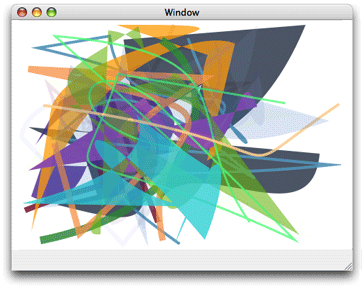

#### 曲线

二次和三次贝塞尔曲线是可以指定任意数量的有趣曲线形状，是一种代数方程曲线。
曲线上的点是由起点、终点及一个或多个控制点指定多项式方程计算出来的。
使用这种方式定义的形状是矢量图形。
存储方程比存储每个点更省内存且能被其它场合重用（译者：矢量图放大不会模糊）。

图3-6 展示了一些独立绘制的曲线。
每个路径包含一个随机生成的曲线；有些被填充有些被绘制出轮廓。

图3-6 多个路径，每个路径包含一个随机生成的曲线

----
多项式方程能升为四次或三次贝塞尔曲线，如何从方程生成曲线的细节本书不讨论，请参考很多数学教材及一些计算机图形学在线资源。

可以使用函数 CGContextAddCurveToPoint 追加内塞尔曲线，曲线从当前点开始用你指定的控制点及终点。
图3-7 展示了从图中当前点、控制点、终点生成的三次贝塞尔曲线。

两个控制点的放置决定了曲线的几何形状。
如果控制点都在起点终点之上，曲线会向上拱。
如果控制点都在起点终点之下，曲线会向下拱。

图3-7 两个控制点的三次贝塞尔曲线

-----

也可以使用函数 CGContextAddQuadCurveToPoint 追加一条二次贝塞尔曲线，当前点到终点之间的曲线形状由一个控制点控制。
图3-8 展示相同的起点终点但是不同的控制点的两条曲线。
控制点决定拱的方向。
由于二次贝塞尔曲线只有一个控制点，它不能创建三次贝塞尔曲线的一些有趣形状。
如：不能使用一个控制点创建交叉效果

图3-8 一个控制点的二次贝塞尔曲线

