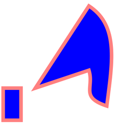
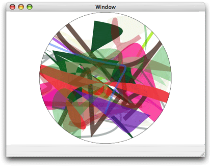

## 路径创建及绘制

路径创建与路径绘制是分开的。
当你想使用 Quartz 绘制路径前，先创建一个路径。
如图3-1 所示，你可以对路径绘制、填充或绘制加填充。
也可以把路径作为其它绘制效果的边界，就是裁剪区域。

图3-2展示了路径绘制效果，这个路径包含两个子路径。
左边子路径是个矩形，右边子路径一个直线跟曲线构成的抽象图形。
每个子路径都是填充且绘制了轮廓。

图3-2 包含两个子图形的路径（子路径）

---

图3-3 展示了多个路径独立绘制。
每个路径都包含一随机产生的曲线，有些是填充路径的有些是绘制路径。
所有的绘制都被裁剪区域限制在一个圆中。

图3-3 裁剪区域

