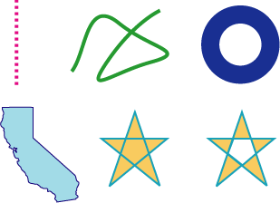

# 路径

路径定义了一个多个形状或子路径。
一个子路径可以由一些直线、曲线组成，可以混合。
可以是开发或闭合的。
子路径可以是简单的线、圆、矩形、星形或复杂的像山一样的形状或抽象涂鸦。
图3-1 展示了一些可以可以创建的路径。
图上左的直线是虚的，线也可以是实线。
图上中弯弯曲曲的线是有几条曲线组成的开放路径。
图上右的同心圆被填充了，没有绘制路径。
图下左的加利福利亚州地图是由一些曲线及线段组成的封闭路径，它被填充且绘制了路径。
图下中右的星星演示了饿填充路径的两种操作，本章稍后介绍。

图3-1 Quartz 支持的基于路径的绘画

本章你会学到如何创建路径、如何绘制路径及影响绘制的一些参数。
